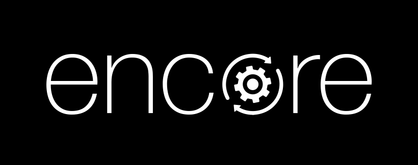

# SVT Encore

[](https://eupl.eu/)
[](https://api.reuse.software/info/github.com/fsfe/reuse-tool)




&nbsp;
&nbsp;

__*This repository hosts the encore fork maintained by [Eyevinn technology](https://eyevinn.se).
The upstream SVT Encore repository can be found at https://github.com/svt/encore.
For more info about the fork, please see the [README-eyevinn.md](README-eyevinn.md) file.*__
  
SVT *Encore* is a scalable video transcoding tool, built on Open Source giants like [FFmpeg](https://www.ffmpeg.org/) and [Spring Boot](https://spring.io/projects/spring-boot).


*Encore* was created to scale, and abstract the transcoding _power of FFmpeg_, and to offer a simple solution for Transcoding - Transcoding-as-a-Service.

*Encore* is aimed at the advanced technical user that needs a scalable video transcoding tool - for example, as a part of their VOD (Video On Demand) transcoding pipeline.

## Features

- Scalable - queuing and concurrency options
- Flexible profile configuration
- Possibility to extend FFmpeg functionality
- Tested and tried in production

_Encore_ is not

- A live/stream transcoder
- A Video packager (see <<faq>>)
- An GUI application

**Scalable video transcoding as a service, built on [FFmpeg](https://www.ffmpeg.org/) and [Spring Boot](https://spring.io/projects/spring-boot).**

Encore wraps FFmpeg behind a REST API and queues transcoding jobs in Redis, distributing work across a horizontally scalable pool of workers. Jobs are defined by reusable YAML transcoding profiles, routed through priority queues so urgent work stays unblocked, and report progress via HTTP callbacks.

It targets advanced users integrating transcoding into automated pipelines — for example, as part of a VOD (Video On Demand) workflow. Encore has been in production at SVT since 2019 and open source since 2021.

**Full documentation: [svt.github.io/encore](https://svt.github.io/encore/)**

## Quickstart

```bash
docker compose up
```

Starts Redis and `encore-web` using the bundled [`docker-compose.yml`](docker-compose.yml). See [Getting Started](https://svt.github.io/encore/getting-started/) for creating a profile and submitting your first job.

http(s)://yourinstance/v3/api-docs/

See [CONTRIBUTING.md](CONTRIBUTING.md). Report bugs and request features via [GitHub Issues](https://github.com/svt/encore/issues).

## License

Copyright 2020–2026 Sveriges Television AB. Licensed under [EUPL-1.2-or-later](LICENSE).

[EUPL-1.2-or-later](LICENSE) license

## Primary maintainer

SVT Videocore Team - (videocore svt se)
